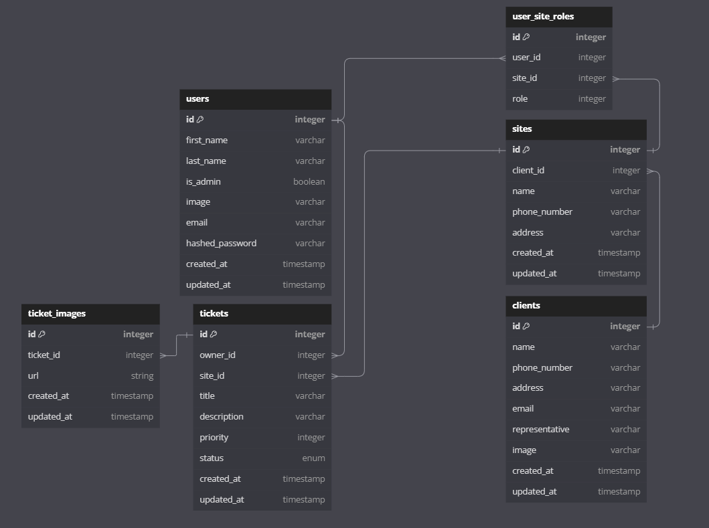

# EmployMe

## Shape of State
```bash
state
├ session
│ └ user = { id, first_name, last_name, email, is_admin }
├ tickets
│ ├ current = { id, title, status, priority, description, created_at, updated_at, images = [...], owner = {...}, site = {...} }
│ ├ passive = { ticket_id : {...}, ...other tickets }
│ └ active = { ticket_id : {...}, ...other tickets }
├ sites 
├ clients
└ ticket_notes
```
## Run Locally
1. Clone this repository (only this branch).
2. Install dependencies.

   ```bash
   pipenv install -r requirements.txt
   ```
3. Create a __.env__ file based on the example with proper settings for your
   development environment.
    - Make sure the SQLite3 database connection URL is in the __.env__ file.
    - Replace the value for
   `SCHEMA` with a unique name, **making sure you use the snake_case
   convention.**
4. In Terminal A : Setup database and run back-end...
   ```bash
   pipenv shell
   ```
   ```bash
   flask db upgrade
   ```
   ```bash
   flask seed all
   ```
   ```bash
   flask run
   ```
5. In Terminal B : Install dependencies and run front-end...
   ```bash
   cd react-vite && npm install
   ```
   ```bash
   npm run build
   ```

<!-- ## Deployment through Render.com

First, recall that Vite is a development dependency, so it will not be used in
production. This means that you must already have the __dist__ folder located in
the root of your __react-vite__ folder when you push to GitHub. This __dist__
folder contains your React code and all necessary dependencies minified and
bundled into a smaller footprint, ready to be served from your Python API.

Begin deployment by running `npm run build` in your __react-vite__ folder and
pushing any changes to GitHub.

Refer to your Render.com deployment articles for more detailed instructions
about getting started with [Render.com], creating a production database, and
deployment debugging tips.

From the Render [Dashboard], click on the "New +" button in the navigation bar,
and click on "Web Service" to create the application that will be deployed.

Select that you want to "Build and deploy from a Git repository" and click
"Next". On the next page, find the name of the application repo you want to
deploy and click the "Connect" button to the right of the name.

Now you need to fill out the form to configure your app. Most of the setup will
be handled by the __Dockerfile__, but you do need to fill in a few fields.

Start by giving your application a name.

Make sure the Region is set to the location closest to you, the Branch is set to
"main", and Runtime is set to "Docker". You can leave the Root Directory field
blank. (By default, Render will run commands from the root directory.)

Select "Free" as your Instance Type.

### Add environment variables

In the development environment, you have been securing your environment
variables in a __.env__ file, which has been removed from source control (i.e.,
the file is gitignored). In this step, you will need to input the keys and
values for the environment variables you need for production into the Render
GUI.

Add the following keys and values in the Render GUI form:

- SECRET_KEY (click "Generate" to generate a secure secret for production)
- FLASK_ENV production
- FLASK_APP app
- SCHEMA (your unique schema name, in snake_case)

In a new tab, navigate to your dashboard and click on your Postgres database
instance.

Add the following keys and values:

- DATABASE_URL (copy value from the **External Database URL** field)

**Note:** Add any other keys and values that may be present in your local
__.env__ file. As you work to further develop your project, you may need to add
more environment variables to your local __.env__ file. Make sure you add these
environment variables to the Render GUI as well for the next deployment.

### Deploy

Now you are finally ready to deploy! Click "Create Web Service" to deploy your
project. The deployment process will likely take about 10-15 minutes if
everything works as expected. You can monitor the logs to see your Dockerfile
commands being executed and any errors that occur.

When deployment is complete, open your deployed site and check to see that you
have successfully deployed your Flask application to Render! You can find the
URL for your site just below the name of the Web Service at the top of the page.

**Note:** By default, Render will set Auto-Deploy for your project to true. This
setting will cause Render to re-deploy your application every time you push to
main, always keeping it up to date.

[Render.com]: https://render.com/
[Dashboard]: https://dashboard.render.com/ -->


<!--  -->
